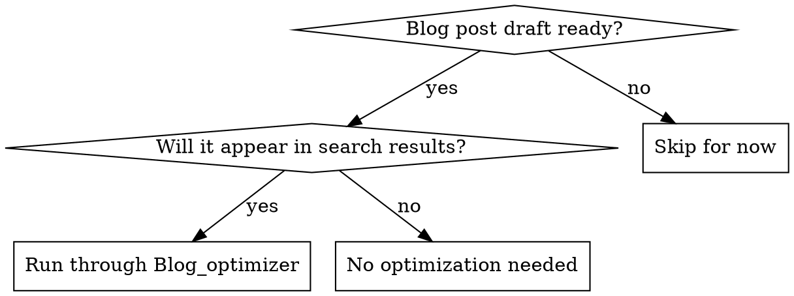

# Blog Optimizer

## Overview

Blog post optimization means systematically improving both search engine visibility (SEO) and reader experience (quality) before publishing. A well-optimized post attracts the right audience through search, then delivers clear value that keeps readers engaged.

**Core principle:** Optimize in two passes—structure and SEO first (when decisions matter most), then polish quality and readability.

## When to Use

**Optimize when:**
- You've finished writing or reviewing a blog post draft
- Before publishing to Sanity CMS
- Before promoting on social or email

**Don't optimize for:**
- Draft sketches or brainstorm notes (too early)
- Internal documentation (wrong audience)
- Posts that won't appear in search results (no SEO value)

## Quick Decision Tree



## The Two-Pass Optimization Process

### PASS 0: Define Audience & Clarity (Before Writing)

Start here—these decisions shape every section.

**0a. Define Your Target Reader**

Write for ONE specific person, not "everyone interested in EVs." This drives all decisions about tone, depth, and examples.

- **Who is this?** New EV owner? Current owner? Considering purchase? Mechanic? (Pick one primary audience)
- **What do they know?** Assume knowledge level: Complete beginner? Some car knowledge? Technical background?
- **What's their pain point?** What specific worry or question brought them here? (e.g., "Will my battery last long enough?" vs. "How do I extend battery lifespan?")

*Document this at the top of your draft: "This post is for [target reader] who [knows/worries about X]."*

**0b. Write Your Clarity of Promise**

The first sentence or two must answer: *What problem does this post solve, why does it matter, and what will the reader learn?*

❌ Bad: "EV batteries degrade over time."
✅ Good: "EV batteries lose capacity over time, but modern cars retain 80–90% after 10 years—here's what causes degradation and how to maximize lifespan."

This is your value proposition. Readers decide in 3 seconds whether to keep reading. Make it explicit.

### PASS 1: SEO and Structure (Front-Loaded Decisions)

These decisions shape the entire post. Do them first when you can still restructure.

**1. Validate Search Intent**

Before writing sections, confirm your post matches what people actually search for.

- **Find the target keyword:** What problem are you solving? (e.g., "how to charge an EV," "EV maintenance costs")
- **Check search intent:** Is it informational (wanting to learn), transactional (wanting to buy/book), or navigational (finding a specific site)?
- **Align your content:** Informational posts teach and compare. Transactional posts help decide between options and include CTAs. Navigational posts answer specific questions.

*If you don't know search volume or difficulty, aim for long-tail keywords (3+ words like "EV charging cost comparison" vs. "EV charging") and write comprehensive posts that naturally rank.*

**2. Structure with SEO Headers**

Your header hierarchy is both a readability tool AND an SEO ranking signal.

- **H1 (Title):** One per post. Include your main keyword naturally. 50–60 characters ideal for search results.
  - ❌ Bad: "EV Charging"
  - ✅ Good: "EV Charging Costs: Level 1, 2 & DC Fast Charging Prices"

- **H2 (Main sections):** 3–5 sections. Each should be answerable by a question readers ask.
  - ✅ Good: "How Much Does EV Charging Cost?" "Where Can I Charge My EV?"

- **H3 (Subsections):** Break H2s into scannable chunks. Use these for specificity (e.g., "Level 2 Home Charging Installation Cost").

*Pro tip:* If you're unsure about structure, ask: "What would a reader search for to find each section?" That's your H2.

**3. Plan Content Depth by Section**

- **Intro paragraph:** Answer the question immediately. Include keyword. (50–100 words)
- **Main sections:** Specific, actionable advice. Use lists and comparisons where possible. (150–250 words each)
- **Conclusion/CTA:** Summarize next steps or call-to-action. (50–100 words)

Target: 800–1,500 words for comprehensive posts. Shorter (400–600) if narrow topic.

### PASS 2: SEO Metadata and Quality Polish

After structure is locked in, optimize the supporting elements.

**4. Write Meta Description (155 characters max)**

Search engines show this snippet. Make it compelling and keyword-inclusive.

- Summarize the post value in one sentence
- Include main keyword naturally
- Make it a reason to click

```
❌ Bad: "This article discusses EV charging"
✅ Good: "EV charging costs vary by type. Learn Level 1, 2 & DC fast charging prices, installation fees, and which fits your budget."
```

**5. Add Internal Links & Connectivity (3–5 strategic links)**

Internal links serve two purposes: they help readers discover related content AND improve SEO. Be intentional about placement and anchor text.

- **Link strategy:** From this post, where would a reader naturally want to go next? (If this is "EV charging costs," link to "choosing a Level 2 charger" or "home installation guide")
- **Anchor text matters:** Use specific, descriptive text: "Learn about Level 2 charging installation costs" not "read this" or "click here"
- **Link placement:** Place links where they're contextually relevant—not just at the end. If section 2 references "battery degradation," link to your battery post there.
- **Reciprocal links:** Update old posts that reference topics now covered in new posts. If you wrote "EV charging 101" before this post, add a link: "For detailed cost breakdown, see [EV charging costs guide](link)"
- **Quantity sweet spot:** 3–5 links is ideal. Fewer than 2 feels sparse; more than 7 feels over-linked and spammy.
- **Trust signals:** Link to authoritative external sources when backing up claims (e.g., EPA data, manufacturer specs). This increases credibility.

*Defer to publication:* If optimizing before your blog structure is finalized, flag related post suggestions in the draft. Your editor/publisher will add links during the publication review when your blog's category structure is clear.

**6. Define Post Category and Tags**

Use consistent categories that match your site structure:
- Choose ONE category that best fits
- Add 3–5 tags for subtopics (searchable within your blog)

*Example:*
- Category: "Charging"
- Tags: #Home-Charging, #Cost-Comparison, #DC-Fast-Charging

**7. Build Authority Through Evidence**

Every non-obvious claim must be backed by evidence, example, or defensible reasoning. Readers trust posts that show their work.

- **Specific numbers over vague claims:** Not "some owners save money" but "Level 2 home charging costs $0.04 per kWh vs. $0.30+ at DC fast chargers"
- **Real-world examples:** Instead of "batteries last longer with proper care," show "Owners who keep daily charge 20–80% report 15% slower degradation than those charging to 100% daily"
- **Source transparency:** When citing data, mention the source (e.g., "According to a 2024 EV battery study" or "Tesla's warranty documentation shows"). If data is from your experience, say so: "In our service shop, we've seen..."
- **Explain the 'why':** Don't just state facts—explain the reasoning. "Heat degrades batteries because it accelerates the chemical reactions inside lithium-ion cells" is stronger than "Heat is bad for batteries"

*Watch for:* Unsourced percentages, claims without examples, "many people say" without specifics.

**7b. Check for Filler (Information Density)**

Every sentence should earn its space. Remove or tighten sections that don't add new value.

- **Intro filler:** "In today's world, electric vehicles are becoming more popular" → Cut. Start with the actual insight.
- **Repeated concepts:** If you explained "battery degradation" in one section, don't re-explain it in the next. Reference it instead.
- **Generic transitions:** "As previously mentioned" or "Furthermore" without adding something new → Tighten or cut.
- **Examples without payoff:** If you mention an example, explain why it matters to the reader.

*Check:* Could I remove any paragraph and still make sense? If yes, it's filler.

**7c. Identify Your Original Payoff**

Posts that rank well and retain readers offer at least one non-generic insight, framework, or synthesis that readers can't find everywhere else.

- **Unique framework:** A new way of thinking about the problem (e.g., the "20–80% charging rule" is a specific, memorable framework)
- **Original synthesis:** Combining existing knowledge in a new way that readers haven't seen
- **Specific example unique to your business:** Your service data, local insights, or proprietary experience
- **Contrarian or surprising take:** Challenging common misconceptions (e.g., "Regenerative braking doesn't reduce battery degradation as much as owners think—here's why")

*Check:* If I removed the brand name, would this post still offer something unique? If it's pure commodity info, add a unique angle.

**7d. Check Content Quality (Readability & Credibility)**

Before publishing, verify:

- **Specificity:** Do all claims have numbers or examples? ("saves 80% on maintenance" not just "saves money")
- **Accuracy:** Are numbers realistic? Did you cite sources for claims?
- **Scanability:** Can readers skim headers and get the main idea?
- **Tone consistency:** Does it match your brand voice? (Knowledgeable, helpful, not sales-y)
- **No jargon** (unless explained): Define technical terms on first use
- **Active voice:** Prefer "manage your charging schedule" over "your charging schedule should be managed"

**8. Ensure Longevity (Evergreen Content)**

Posts that remain valuable for 2+ years require different treatment than topical pieces. Plan for minimal revision.

- **Avoid time-bound claims:** Not "in 2024" but "as of March 2024" (easier to update). Better: frame claims as timeless principles.
- **Use version-agnostic examples:** Instead of "the 2024 Tesla Model Y," say "modern EVs" or "current Tesla lineup."
- **Future-proof numbers:** Use ranges or comparisons instead of absolutes: "batteries typically cost $5,000–$15,000" (true over years) vs. "batteries cost $8,000 in 2024" (outdated in 6 months).
- **Link to updatable content:** If you reference "latest battery tech," link to a resource you'll update, not a static fact.
- **Identify quick-update sections:** Mark sections that will need refresh (warranty info, pricing). Plan to revisit annually.

*Check:* Will 80% of this content be useful in 2028? If not, either make it evergreen or plan it as a topical post that doesn't need longevity.

**9. Add Visual Elements (if applicable)**

- **Title image:** Show what the post is about (EV, charging station, etc.)
- **Inline images/tables:** Break up long text, show comparisons, demonstrate processes
- **Alt text:** Write descriptive alt text for accessibility and image search SEO

## Optimization Checklist

**PASS 0: Foundation**
- [ ] **Target reader defined:** Written for one specific audience with clear knowledge level
- [ ] **Clarity of promise:** First paragraph clearly states problem, why it matters, what reader will learn
- [ ] **Original payoff:** Post includes at least one unique insight, framework, or synthesis (not generic commodity info)

**PASS 1: Structure & SEO**
- [ ] **Keyword validated:** Post matches actual search intent and difficulty
- [ ] **H1 title:** Includes keyword, 50–60 characters, compelling
- [ ] **H2 structure:** 3–5 main sections answering reader questions
- [ ] **H3 subsections:** Break long sections into scannable chunks
- [ ] **Logical flow:** Sections build coherently; no broken reasoning links

**PASS 2: Content Quality**
- [ ] **Authority & evidence:** Non-obvious claims backed by numbers, examples, sources, or reasoning
- [ ] **Information density:** No filler; every section adds new value
- [ ] **Longevity:** Most content remains useful 2+ years; minimal revision needed
- [ ] **Specificity:** All major claims have numbers, examples, or sources (not "many" → "80%")
- [ ] **Tone & Polish:** Matches brand voice, active voice, no jargon without explanation, clean prose
- [ ] **Scannability:** Reader can skim headers and understand main points

**PASS 3: SEO Metadata & Navigation**
- [ ] **Meta description:** 155 characters, keyword-included, clickable
- [ ] **Internal links:** 3–5 strategic links to related posts with descriptive anchor text
- [ ] **Connectivity:** Links to related content; reciprocal links added to old posts referencing this topic
- [ ] **Category/tags:** One category + 3–5 relevant tags
- [ ] **Visual elements:** Title image + inline images/tables with alt text

**PASS 4: Actionability**
- [ ] **CTA/next steps:** Post ends with clear, natural next action that follows from argument
- [ ] **Word count:** 800–1,500 words (or appropriately scoped for topic)

## Common Mistakes

| Mistake | Fix |
|---------|-----|
| Title has no keyword | Rewrite to naturally include what readers search for |
| Random H2 order | Reorder so H2s answer questions in logical sequence |
| Meta description is generic | Write a one-sentence summary that makes readers want to click |
| No internal links | Find 2–5 related posts, update anchor text to be specific |
| Numbers without sources | Add realistic data, cite sources, or remove unsupported claims |
| Too generic/vague language | Replace "important" with "saves 40%," replace "many" with specific numbers |
| 3,000+ words on narrow topic | Trim to most important info; split into separate posts if needed |
| Skips CTA entirely | Add "next steps" or call-to-action (book service, read related post, etc.) |

## Real-World Impact

A well-structured, SEO-optimized post reaches the right readers, answers their questions clearly, and drives the outcome you want (bookings, signups, shares, authority). Posts that skip SEO optimization might be well-written but invisible in search results—effort wasted.

**Example:** An optimized "EV charging cost" post with clear H2 structure, keyword-rich title, and internal links can rank in top 10 for that keyword, driving consistent monthly traffic. The same information in a generic title with poor structure ranks on page 5+, nearly invisible.

## Quick Reference: SEO Elements at a Glance

| Element | Purpose | Best Practice |
|---------|---------|----------------|
| **H1 Title** | Main keyword signal + click attraction | 50–60 chars, keyword-first, compelling |
| **Meta Description** | Search snippet + CTR driver | 155 chars max, keyword + benefit, clickable tone |
| **H2 Headers** | Scanability + subkeyword signals | 3–5 per post, question-based |
| **H3 Subheaders** | Topic specificity + readability | Break H2s into chunks, specific terms |
| **Internal Links** | Reader navigation + SEO authority | 2–5 links with descriptive anchor text |
| **Word Count** | Depth signal (not magic number) | 800–1,500 for comprehensive; 400–600 for narrow |
| **Category/Tags** | Faceted navigation + filtering | 1 category, 3–5 tags per post |
| **Images + Alt Text** | Visual interest + image search | Relevant visuals with descriptive alt text |


## Cost
~ $0.02-0.05 cents per generation