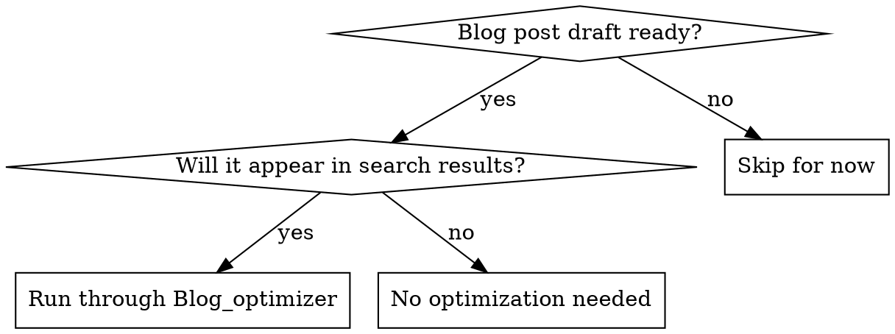

# Blog Optimizer

## Overview

Blog post optimization means systematically improving both search engine visibility (SEO) and reader experience (quality) before publishing. A well-optimized post attracts the right audience through search, then delivers clear value that keeps readers engaged.

**Core principle:** Optimize in two passes—structure and SEO first (when decisions matter most), then polish quality and readability.

## When to Use

**Optimize when:**
- You've finished writing or reviewing a blog post draft
- Before publishing to Sanity CMS
- Before promoting on social or email

**Don't optimize for:**
- Draft sketches or brainstorm notes (too early)
- Internal documentation (wrong audience)
- Posts that won't appear in search results (no SEO value)

## Quick Decision Tree



## The Two-Pass Optimization Process

### PASS 0: Define Audience & Clarity (Before Writing)

Start here—these decisions shape every section.

**0a. Define Your Target Reader (Non-Negotiable)**

Write for ONE specific person, not "everyone interested in EVs." Specificity drives tone, depth, examples, and most importantly—your CTA's effectiveness.

**Audience specificity formula:**
- **Segment:** Current EV owner? Considering purchase? Mechanic? Business fleet manager? (Pick ONE)
- **Knowledge level:** Complete beginner? Some car knowledge? Technical/professional background?
- **Pain point:** What specific problem brings them here? (e.g., "Will my battery last?" vs. "How do I maximize battery lifespan?" are different audiences)
- **Climate/context:** Cold climate? Urban commuter? Long-distance traveler? Budget-conscious? This shapes every decision.
- **Intent:** Are they researching, comparing specific products, or ready to make a decision?
- **Search behavior:** What exact words would they Google? This becomes your keyword.

**Example (specific, not generic):**
❌ "EV owners concerned about winter"
✅ "Current EV owner in the Northeast, knows how to check tire pressure, worried about range loss in winter, has a tech-savvy mindset, considering whether winter is tolerable, searches 'EV winter range loss'"

*Document this at the top of your draft as a narrative:* "This post is for [segment] in [climate/context] who [pain point], has [knowledge level], ready to [action]."

**Why granularity matters:**
- A post for "people considering EVs" uses different examples than "EV owners optimizing for winter"
- Knowledge level affects link depth (link to "what is regenerative braking" vs. skip it)
- Pain point shapes your unique angle (safety angle vs. cost angle vs. performance angle)
- Climate/context determines which EV models matter (Model 3 beats Ioniq 6 in cold; reverse true in mild climates)
- Each specific audience has different CTAs (buy this car vs. book a service vs. download a guide)

**Posts written for everyone convert no one. Posts written for someone convert many.**

**0b. Write Your Clarity of Promise (First Paragraph is Critical)**

The first paragraph must answer: *What problem does this post solve, why does it matter RIGHT NOW, and what specific outcome will the reader achieve?*

❌ Bad: "EV batteries degrade over time."
✅ Good: "EV batteries lose capacity over time, but modern cars retain 80–90% after 10 years. Here's what causes degradation, which driving habits accelerate it most, and the specific actions that maximize lifespan—so you can protect your $15,000 battery investment."

**The promise formula:** [Problem] + [Stakes/Why it matters now] + [Specific benefit] + [What you'll learn].

This is your value proposition. Readers decide in 3 seconds whether to keep reading. Make it explicit and specific to your target audience's pain point.

### PASS 1: SEO and Structure (Front-Loaded Decisions)

These decisions shape the entire post. Do them first when you can still restructure.

**1. Validate Search Intent**

Before writing sections, confirm your post matches what people actually search for.

- **Find the target keyword:** What problem are you solving? (e.g., "how to charge an EV," "EV maintenance costs")
- **Check search intent:** Is it informational (wanting to learn), transactional (wanting to buy/book), or navigational (finding a specific site)?
- **Align your content:** Informational posts teach and compare. Transactional posts help decide between options and include CTAs. Navigational posts answer specific questions.

*If you don't know search volume or difficulty, aim for long-tail keywords (3+ words like "EV charging cost comparison" vs. "EV charging") and write comprehensive posts that naturally rank.*

**2. Structure with SEO Headers**

Your header hierarchy is both a readability tool AND an SEO ranking signal.

- **H1 (Title):** One per post. Include your main keyword naturally. 50–60 characters ideal for search results.
  - ❌ Bad: "EV Charging"
  - ✅ Good: "EV Charging Costs: Level 1, 2 & DC Fast Charging Prices"

- **H2 (Main sections):** 3–5 sections. Each should be answerable by a question readers ask.
  - ✅ Good: "How Much Does EV Charging Cost?" "Where Can I Charge My EV?"

- **H3 (Subsections):** Break H2s into scannable chunks. Use these for specificity (e.g., "Level 2 Home Charging Installation Cost").

*Pro tip:* If you're unsure about structure, ask: "What would a reader search for to find each section?" That's your H2.

**3. Plan Content Depth by Section**

- **Intro paragraph:** Answer the question immediately. Include keyword. (50–100 words)
- **Main sections:** Specific, actionable advice. Use lists and comparisons where possible. (150–250 words each)
- **Conclusion/CTA:** Summarize next steps or call-to-action. (50–100 words)

Target: 800–1,500 words for comprehensive posts. Shorter (400–600) if narrow topic.

### PASS 2: SEO Metadata and Quality Polish

After structure is locked in, optimize the supporting elements.

**4. Write Meta Description (155 characters max)**

Search engines show this snippet. Make it compelling and keyword-inclusive.

- Summarize the post value in one sentence
- Include main keyword naturally
- Make it a reason to click

```
❌ Bad: "This article discusses EV charging"
✅ Good: "EV charging costs vary by type. Learn Level 1, 2 & DC fast charging prices, installation fees, and which fits your budget."
```

**5. Add Internal Links & External Links (Mandatory: 2–5 actual hyperlinks)**

Linking is non-negotiable. Internal links help readers navigate your content AND improve SEO. External links build credibility and trust signals. **Citations alone don't count—links must be actual hyperlinks [like this](url).**

**Internal links (at least 2–3 real hyperlinks):**
- **Link strategy:** From this post, where would a reader naturally want to go next? (If this is "EV charging costs," link to "choosing a Level 2 charger" or "home installation guide")
- **Anchor text matters:** Use specific, descriptive text: "[Learn about Level 2 charging installation costs](url)" not "read this" or "click here"
- **Link placement:** Place links where they're contextually relevant—not just at the end. If a section references "battery degradation," link to your battery post there, in the moment it's relevant.
- **Reciprocal links:** Update old posts that reference topics now covered in new posts. If you wrote "EV charging 101" before this post, add a link: "For detailed cost breakdown, [see our EV charging costs guide](url)"
- **Quantity sweet spot:** 3–5 links is ideal. Fewer than 2 feels sparse; more than 7 feels over-linked and spammy.

**External links (at least 1–2 real hyperlinks for credibility):**
- **Trust signals:** Link to authoritative external sources when backing up claims: EPA data, manufacturer specs, academic research, industry reports, DOT databases.
- **Examples:** "[According to EPA data on EV efficiency](https://...)" or "[Tesla's warranty documentation](https://...)"
- **Real links, not citations:** "According to a 2024 study" is a citation. "[According to this 2024 MIT study](https://...)" is a link. Always include the actual URL.
- **Verify links work:** Before publishing, test every link—dead links tank credibility and SEO.

**Link checklist:**
- [ ] At least 2 internal links with descriptive anchor text (not "learn more," but "[learn about EV regenerative braking](url)")
- [ ] At least 1–2 external links to authoritative sources (EPA, manufacturer, research, government databases)
- [ ] All links are contextually placed (not just in footer)
- [ ] All links are tested and working before publishing
- [ ] No generic anchor text ("click here," "read more")

**6. Define Post Category and Tags**

Use consistent categories that match your site structure:
- Choose ONE category that best fits
- Add 3–5 tags for subtopics (searchable within your blog)

*Example:*
- Category: "Charging"
- Tags: #Home-Charging, #Cost-Comparison, #DC-Fast-Charging

**7. Build Authority Through Evidence (Non-Negotiable)**

Every non-obvious claim must be backed by evidence, example, source, or defensible reasoning. Readers trust posts that show their work. Unsourced claims tank credibility and search ranking.

**Citation checklist:**
- [ ] Every percentage/statistic has a source: "According to [source], X% of EVs..." not "Studies show..." or bare numbers
- [ ] Real-world examples back up abstract claims: Instead of "batteries last longer with proper care," show "Owners who keep daily charge 20–80% report 15% slower degradation than those charging to 100% daily (Tesla owner data, 2024)"
- [ ] **Source priority:** Manufacturer specs > Academic research > Your proprietary data > Industry data > Your general experience > Third-party analysis
- [ ] Explain the 'why:' Don't just state facts—explain the mechanism. "Heat degrades batteries because it accelerates lithium-ion reactions (which wear electrode material faster)" is stronger than "Heat is bad"
- [ ] Time-bound claims get date stamps: Not "EVs cost $15,000" but "EV batteries currently cost $10,000–$15,000 (as of 2026)"
- [ ] **Proprietary data is gold:** If you have shop data, customer feedback, or service records, USE IT. "We serviced 500 EVs in 2025 and found..." is more credible than generic industry stats.

**Red flags (fix these):**
- Vague claims: "some owners," "many people," "studies show" (cite the actual study)
- Unsourced percentages: "saves 40%" without a source
- Claims without examples: "important to maintain" (important why? show an example)
- Generic language: "good performance" (show numbers: "accelerates 0–60 in 5.5s")
- Missing proprietary data: If you have shop/customer data, not using it is leaving money on the table—your unique angle is wasted

**7b. Check for Filler (Information Density)**

Every sentence should earn its space. Remove or tighten sections that don't add new value.

- **Intro filler:** "In today's world, electric vehicles are becoming more popular" → Cut. Start with the actual insight.
- **Repeated concepts:** If you explained "battery degradation" in one section, don't re-explain it in the next. Reference it instead.
- **Generic transitions:** "As previously mentioned" or "Furthermore" without adding something new → Tighten or cut.
- **Examples without payoff:** If you mention an example, explain why it matters to the reader.

*Check:* Could I remove any paragraph and still make sense? If yes, it's filler.

**7c. Identify Your Original Payoff (Required)**

Generic posts are invisible. Posts that rank and retain readers offer at least ONE non-obvious insight, framework, or synthesis.

**Techniques to create original payoff:**

1. **Unique framework:** A memorable way to think about the problem (e.g., "the 20–80% charging rule" is catchier and more actionable than "charge optimally")
   - ✅ Example: "The Regenerative Braking Myth: Why EVs Still Need Friction Brakes in 3 Scenarios"
   - Gives you a novel angle competitors didn't explore

2. **Original synthesis:** Combine existing knowledge in a new way
   - ✅ Example: "EV maintenance costs aren't lower because of X, Y, Z—here's the cost comparison no one talks about"
   - Takes 3 things readers know separately and shows why their interaction matters

3. **Specific data unique to your business:** Service shop data, geographic insights, customer feedback
   - ✅ Example: "We serviced 1,000 EVs in 2025. Here's what breaks first and when—the real maintenance timeline"
   - Competitors don't have this data

4. **Contrarian take:** Challenge misconceptions
   - ✅ Example: "EV brake pads last 2–3x longer—so why do some owners replace them at 50,000 miles? (3 reasons, with data)"
   - Counter-intuitive angle hooks readers

5. **Comparison or ladder:** Show progression or trade-offs others haven't
   - ✅ Example: "EV charging at home vs. public vs. DC: Cost, time, and degradation per charge (with math)"
   - Readers want to know the nuanced comparison

**Red flags (too generic):**
- ❌ "Everything you need to know about EV batteries" (commodity info)
- ❌ Repeating manufacturer marketing (e.g., "Tesla batteries are good for 10 years")
- ❌ Generic advice ("maintain your car regularly")

**Check before publishing:** If you removed your brand name, would a reader still find this post valuable and different from 5 other posts on the topic? If no, add one of the techniques above.

**7d. Check Content Quality (Readability & Credibility)**

Before publishing, verify:

- **Specificity:** Do all claims have numbers or examples? ("saves 80% on maintenance" not just "saves money")
- **Accuracy:** Are numbers realistic? Did you cite sources for claims?
- **Scanability:** Can readers skim headers and get the main idea?
- **Tone consistency:** Does it match your brand voice? (Knowledgeable, helpful, not sales-y)
- **No jargon** (unless explained): Define technical terms on first use
- **Active voice:** Prefer "manage your charging schedule" over "your charging schedule should be managed"

**8. Ensure Longevity (Evergreen Content)**

Posts that remain valuable for 2+ years require different treatment than topical pieces. Plan for minimal revision.

- **Avoid time-bound claims:** Not "in 2024" but "as of March 2024" (easier to update). Better: frame claims as timeless principles.
- **Use version-agnostic examples:** Instead of "the 2024 Tesla Model Y," say "modern EVs" or "current Tesla lineup."
- **Future-proof numbers:** Use ranges or comparisons instead of absolutes: "batteries typically cost $5,000–$15,000" (true over years) vs. "batteries cost $8,000 in 2024" (outdated in 6 months).
- **Link to updatable content:** If you reference "latest battery tech," link to a resource you'll update, not a static fact.
- **Identify quick-update sections:** Mark sections that will need refresh (warranty info, pricing). Plan to revisit annually.

*Check:* Will 80% of this content be useful in 2028? If not, either make it evergreen or plan it as a topical post that doesn't need longevity.

**9. Add Visual Elements (if applicable)**

- **Title image:** Show what the post is about (EV, charging station, etc.)
- **Inline images/tables:** Break up long text, show comparisons, demonstrate processes
- **Alt text:** Write descriptive alt text for accessibility and image search SEO

## Advanced: Use Proprietary Data to Dominate

**The secret to beating competitors:** Use data only you have.

If you're a service shop, you have gold: real customer data, failure patterns, cost trends, longevity data. Competitors can't replicate this. A blog post built on proprietary data (or synthesized from your experience) is instantly more credible and unique.

### Examples of Proprietary Data to Feature

- **"We serviced X vehicles and found..."** – Your shop's maintenance trends
- **"Our customers report..."** – Aggregated feedback from your clients
- **"Cost analysis from 500+ service records..."** – Real cost data from your business
- **"Comparison table of [product] performance based on Y years of data"** – Proprietary benchmarking

### How to Present Proprietary Data

1. **Comparison tables:** Rank products/solutions side-by-side. Add a column only YOU have (e.g., "What our customers prefer," "Real-world durability," "Maintenance cost").
2. **Aggregate anonymized customer data:** "500+ EV owners in our service base show X pattern..." (no individual names, all aggregated).
3. **Trend analysis:** "Over the past 3 years, we've seen the following shift..."
4. **Cost breakdowns:** "Based on actual parts costs and labor in our shop..."
5. **Before/after case studies:** Real customer examples (anonymized) showing impact.

**Why this works:**
- Competitors can't match your data without doing the same work
- Google recognizes unique, first-party research and ranks it higher
- Readers trust data more than marketing claims
- Your authority skyrockets—you're *the expert*

---

## Critical: Call-to-Action (CTA) Strategy

**Every post must end with ONE clear action.** Posts without CTAs leave readers hanging and waste your traffic.

**CTA formula:** [Specific action] + [Why now] + [Where to go]

❌ Bad: "Thanks for reading. Contact us if you have questions."
✅ Good: "If your brake warning light is on, book a diagnostic service today—delays can affect safety."

✅ Good: "Ready to optimize your charging? See our guide to [specific related post about smart charging]."

**CTA options (pick one that fits):**
- **Book/schedule:** "Schedule a brake inspection" (best for service businesses)
- **Read next:** "Learn about [related topic] in our [post name]"
- **Download/guide:** "Download our EV maintenance checklist"
- **Newsletter:** "Get monthly EV tips in your inbox"
- **Contact:** "Have questions? [contact method]"

**CTA placement:** Always at the very end, after conclusion. No additional content after CTA.

**CTA specificity matters:**
- ❌ "Learn more"
- ✅ "See our complete guide to EV brake service costs"

---

## Optimization Checklist

**PASS 0: Foundation**
- [ ] **Target reader defined:** Written for one specific audience with clear knowledge level
- [ ] **Clarity of promise:** First paragraph clearly states problem, why it matters, what reader will learn
- [ ] **Original payoff:** Post includes at least one unique insight, framework, or synthesis (not generic commodity info)

**PASS 1: Structure & SEO**
- [ ] **Keyword validated:** Post matches actual search intent and difficulty
- [ ] **H1 title:** Includes keyword, 50–60 characters, compelling
- [ ] **H2 structure:** 3–5 main sections answering reader questions
- [ ] **H3 subsections:** Break long sections into scannable chunks
- [ ] **Logical flow:** Sections build coherently; no broken reasoning links

**PASS 2: Content Quality**
- [ ] **Authority & evidence:** Non-obvious claims backed by numbers, examples, sources, or reasoning
- [ ] **Information density:** No filler; every section adds new value
- [ ] **Longevity:** Most content remains useful 2+ years; minimal revision needed
- [ ] **Specificity:** All major claims have numbers, examples, or sources (not "many" → "80%")
- [ ] **Tone & Polish:** Matches brand voice, active voice, no jargon without explanation, clean prose
- [ ] **Scannability:** Reader can skim headers and understand main points

**PASS 3: SEO Metadata & Navigation**
- [ ] **Meta description:** 155 characters, keyword-included, clickable
- [ ] **Internal links:** 3–5 strategic links to related posts with descriptive anchor text
- [ ] **Connectivity:** Links to related content; reciprocal links added to old posts referencing this topic
- [ ] **Category/tags:** One category + 3–5 relevant tags
- [ ] **Visual elements:** Title image + inline images/tables with alt text

**PASS 4: Actionability & CTA**
- [ ] **CTA/next steps:** Post ends with ONE clear, natural action that follows naturally from argument (not generic)
- [ ] **CTA is specific:** "Book a service" not "contact us." "Read our brake maintenance guide" not "learn more"
- [ ] **Word count:** 800–1,500 words (or appropriately scoped for topic)

## Common Mistakes

| Mistake | Fix |
|---------|-----|
| Title has no keyword | Rewrite to naturally include what readers search for |
| Random H2 order | Reorder so H2s answer questions in logical sequence |
| Meta description is generic | Write a one-sentence summary that makes readers want to click |
| No internal links | Find 2–5 related posts, update anchor text to be specific |
| Numbers without sources | Add realistic data, cite sources, or remove unsupported claims |
| Too generic/vague language | Replace "important" with "saves 40%," replace "many" with specific numbers |
| 3,000+ words on narrow topic | Trim to most important info; split into separate posts if needed |
| Skips CTA entirely | Add "next steps" or call-to-action (book service, read related post, etc.) |

## Real-World Impact

A well-structured, SEO-optimized post reaches the right readers, answers their questions clearly, and drives the outcome you want (bookings, signups, shares, authority). Posts that skip SEO optimization might be well-written but invisible in search results—effort wasted.

**Example:** An optimized "EV charging cost" post with clear H2 structure, keyword-rich title, and internal links can rank in top 10 for that keyword, driving consistent monthly traffic. The same information in a generic title with poor structure ranks on page 5+, nearly invisible.

## Quick Reference: SEO Elements at a Glance

| Element | Purpose | Best Practice |
|---------|---------|----------------|
| **H1 Title** | Main keyword signal + click attraction | 50–60 chars, keyword-first, compelling |
| **Meta Description** | Search snippet + CTR driver | 155 chars max, keyword + benefit, clickable tone |
| **H2 Headers** | Scanability + subkeyword signals | 3–5 per post, question-based |
| **H3 Subheaders** | Topic specificity + readability | Break H2s into chunks, specific terms |
| **Internal Links** | Reader navigation + SEO authority | 2–5 links with descriptive anchor text |
| **Word Count** | Depth signal (not magic number) | 800–1,500 for comprehensive; 400–600 for narrow |
| **Category/Tags** | Faceted navigation + filtering | 1 category, 3–5 tags per post |
| **Images + Alt Text** | Visual interest + image search | Relevant visuals with descriptive alt text |